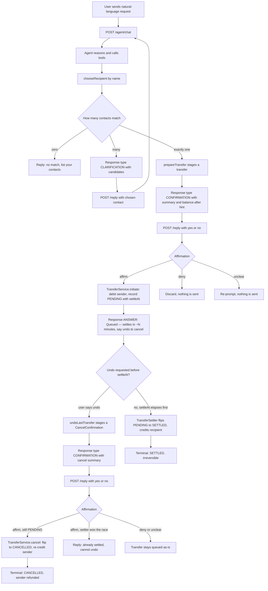
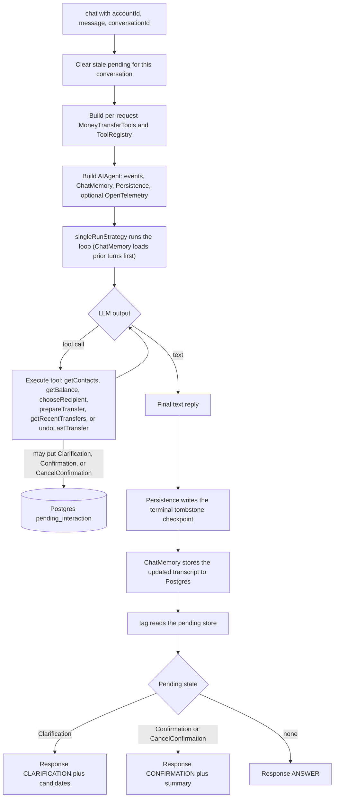
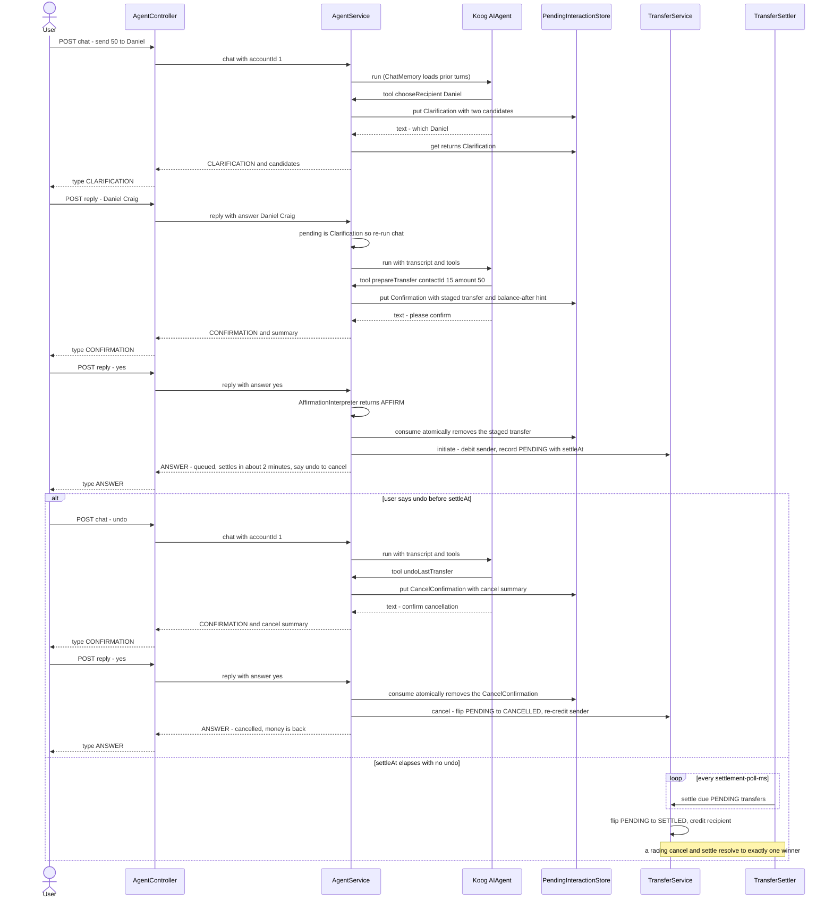

# Agent Flow (steps 3–7 — tools, HITL & async settlement)

Step 3 turned the step-2 chat endpoint into a **tool-using agent** over the money-transfer
domain, with a human-in-the-loop (HITL) confirmation before any money moves. Steps 5–7 made
that state durable (Postgres-backed `ChatMemory`/`Persistence`) and split money movement into an
async **queue → settle** pipeline with an undo window. This page traces both the **business
logic** (what the user experiences) and the **agentic flow** (how a turn runs internally), and
shows **how to interact** with the app in this state.

Key components:

| Component | Role |
|-----------|------|
| `AgentController` | REST surface: `POST /agent/chat`, `POST /agent/{conversationId}/reply`, `GET /agent/{conversationId}/status` |
| `AgentService` | Orchestrates a turn: builds the agent, runs it, tags the outcome, resolves confirmation/cancellation replies |
| `agent.tools.MoneyTransferTools` | Koog `ToolSet`: `getContacts`, `getBalance`, `chooseRecipient`, `prepareTransfer` (stages only), `getRecentTransfers`, `undoLastTransfer` (stages only) — read tools return typed views (`ContactView`/`BalanceView`/`TransferView`), not strings |
| `ChatMemory` / `ChatHistoryProvider` | Koog's Postgres-backed transcript per `conversationId` (replaces the old in-memory `ConversationStore`) |
| `agent.hitl.PendingInteractionStore` | Postgres-backed: what a conversation is awaiting — a `Clarification`, a `Confirmation` (send), or a `CancelConfirmation` (undo) |
| `agent.hitl.AffirmationInterpreter` | Deterministic natural-language yes/no (no LLM on the money path) |
| `ContactService` / `TransferService` | Domain services the tools delegate to; `TransferService` owns the `PENDING → SETTLED/CANCELLED/FAILED` state machine |
| `TransferSettler` | `@Scheduled` poller that settles due `PENDING` transfers (the outbox-style async half of a send) |

## Business logic — the money-transfer conversation

What happens end-to-end when a user asks to send money, including the HITL branches (ambiguous
recipient → clarify; staged transfer → confirm) and, once a transfer is queued, the async
**settle-vs-undo** race that decides whether it becomes final.



**The money-safety guarantee:** `prepareTransfer` and `undoLastTransfer` never move money — they
only *stage* an intent (`StagedTransfer` / a cancel request). The actual debit
(`TransferService.initiate`) and re-credit (`TransferService.cancel`) run **app-side**, only in
the `affirm` branch, only after the user's explicit "yes". A queued transfer isn't final either:
it sits as `PENDING` until `TransferSettler` settles it or the user undoes it first — every
transition out of `PENDING` is a single atomic conditional `UPDATE`, so a racing cancel and
settle resolve to exactly one winner. The LLM never reaches the ledger directly.

## Agentic flow — how one `/chat` turn runs

Inside a single turn, `AgentService` builds a fresh tool-enabled agent and lets Koog's
`singleRunStrategy` drive the LLM-and-tools loop, then classifies the outcome from the pending
store. `ChatMemory` and `Persistence` (both Postgres-backed, keyed by `conversationId` as the
run's `sessionId`) replace the old hand-rolled transcript replay.



**Multi-LLM fallback:** the run is wrapped in an ordered `llms` loop (Anthropic first, then
OpenAI `gpt-5.4`). If the whole run throws on the first model, it retries on the next; because
`prepareTransfer`/`undoLastTransfer` only stage, retrying a turn never double-sends or
double-cancels money.

**Checkpoint tombstone (`/status`):** a clean run always ends by writing a tombstone checkpoint;
a run that dies mid-flight (crash, provider failure on the last fallback) leaves a non-tombstone
checkpoint as the latest one. `GET /agent/{conversationId}/status` inspects just the latest
checkpoint to report `NONE` / `COMPLETED` / `INTERRUPTED` — no extra bookkeeping needed.

## HITL sequence — the two Daniels, end to end, then settle or undo



## How to interact with the app (this state)

### Run it
```bash
export ANTHROPIC_API_KEY=sk-ant-...
export OPENAI_API_KEY=sk-...
./gradlew bootRun
```
Postgres starts via Docker Compose, Flyway seeds the demo data (accounts 1–6, with two
"Daniel"s in user 1's contacts). Swagger UI: http://localhost:8080/swagger-ui.html

### Two ways in
- **Domain REST** (no AI) — direct endpoints from step 1: `GET /api/v1/contacts`,
  `GET /api/v1/accounts/{id}/balance`, `POST /api/v1/transfers`, `GET /api/v1/transfers`.
- **Agent** (this step) — natural language: `POST /api/v1/agent/chat` and
  `POST /api/v1/agent/{conversationId}/reply`. Both take the acting user via `X-User-Id`.

### Agent response shape
Every agent response is tagged so the client knows what to do next:

| `type` | Meaning | What to send next |
|--------|---------|-------------------|
| `ANSWER` | Plain reply, nothing pending | Nothing (or a new `/chat`) |
| `CLARIFICATION` | Ambiguous recipient; `candidates[]` lists the options | `POST /reply` naming the chosen contact |
| `CONFIRMATION` | A transfer is staged; `transferSummary` describes it | `POST /reply` with a yes/no answer |

### Walkthrough — ambiguous recipient → confirm → send
```bash
# 1) Ask to send to an ambiguous recipient
curl -s -X POST http://localhost:8080/api/v1/agent/chat \
  -H "X-User-Id: 1" -H "Content-Type: application/json" \
  -d '{"message": "send 50 euros to Daniel for dinner"}'
# → {"type":"CLARIFICATION","reply":"Which Daniel …","conversationId":"<id>",
#     "candidates":[{"contactId":14,"displayName":"Daniel Anderson"},
#                   {"contactId":15,"displayName":"Daniel Craig"}]}

# 2) Pick the contact (reuse the returned conversationId)
curl -s -X POST http://localhost:8080/api/v1/agent/<id>/reply \
  -H "X-User-Id: 1" -H "Content-Type: application/json" \
  -d '{"answer": "Daniel Craig"}'
# → {"type":"CONFIRMATION","reply":"Please confirm …","conversationId":"<id>",
#     "transferSummary":"Send $50 to Daniel Craig for \"dinner\""}

# 3) Confirm in natural language — the transfer is queued (step 7: settles after the undo window)
curl -s -X POST http://localhost:8080/api/v1/agent/<id>/reply \
  -H "X-User-Id: 1" -H "Content-Type: application/json" \
  -d '{"answer": "yeah go ahead"}'
# → {"type":"ANSWER","reply":"Queued — $50.00 to Daniel Craig settles in about 2 minutes; say \"undo\" before then to cancel.","conversationId":"<id>"}
```

Reply `"no"` / `"cancel"` at step 3 instead and nothing is sent. An unrecognized reply
(e.g. `"hmm"`) returns `CONFIRMATION` again and re-prompts — money never moves on an ambiguous
answer.

### Notes for this state
- **No auth yet:** the acting user is whatever `X-User-Id` you send. Tools enforce that a
  `contactId` belongs to that user, but there is no authentication (out of scope until later).
- **Conversation state is durable (step 5):** transcripts (`ChatMemory`) and pending
  clarifications/confirmations (`PendingInteractionStore`) are Postgres-backed, keyed by
  `conversationId` — a restart doesn't lose a paused confirmation.
- **Over-balance requests get a choice, not a failure (step 4):** `prepareTransfer` refuses to
  stage an over-balance request and instead asks the user how much to send, up to their
  available balance — the user picks the amount, not the tool.
- **Sends aren't instant (step 7):** a confirmed send is *queued*, not executed — it debits the
  sender immediately but only credits the recipient once `TransferSettler` settles it, unless the
  user says "undo" first.
