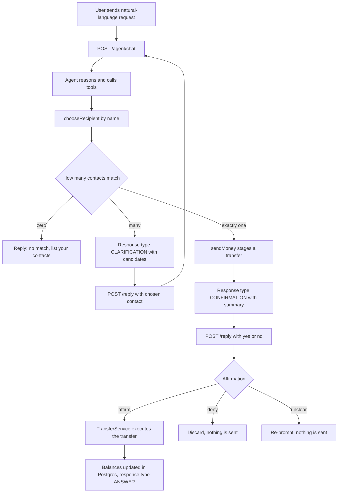
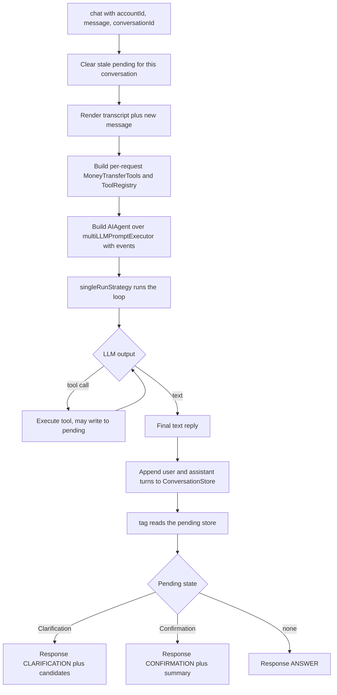
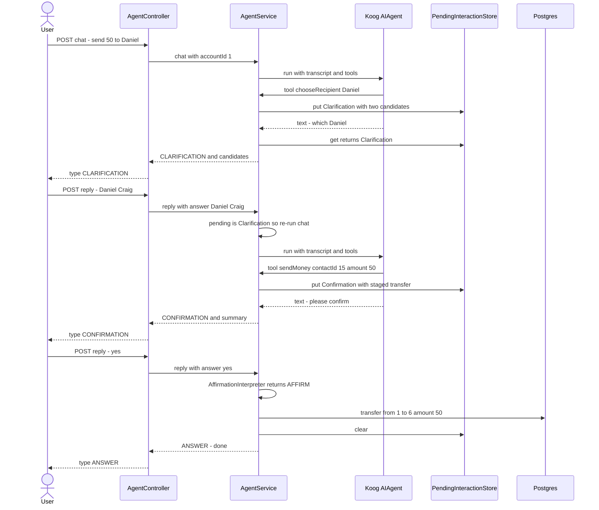

# Agent Flow (step 3 — tools & human-in-the-loop)

Step 3 turns the step-2 chat endpoint into a **tool-using agent** over the money-transfer
domain, with a human-in-the-loop (HITL) confirmation before any money moves. This page traces
both the **business logic** (what the user experiences) and the **agentic flow** (how a turn
runs internally), and shows **how to interact** with the app in this state.

Key components:

| Component | Role |
|-----------|------|
| `AgentController` | REST surface: `POST /agent/chat`, `POST /agent/{conversationId}/reply` |
| `AgentService` | Orchestrates a turn: builds the agent, runs it, tags the outcome, resolves replies |
| `MoneyTransferTools` | Koog `ToolSet`: `getContacts`, `chooseRecipient`, `sendMoney` (stages only) |
| `ConversationStore` | In-memory transcript per `conversationId` (the HITL "memory") |
| `PendingInteractionStore` | What a conversation is awaiting: a `Clarification` or a `Confirmation` |
| `AffirmationInterpreter` | Deterministic natural-language yes/no (no LLM on the money path) |
| `ContactService` / `TransferService` | Step-1 domain services the tools delegate to |

## Business logic — the money-transfer conversation

What happens end-to-end when a user asks to send money, including the two HITL branches
(ambiguous recipient → clarify; staged transfer → confirm).



**The money-safety guarantee:** `sendMoney` never moves money — it only *stages* a
`StagedTransfer`. The actual `TransferService.transfer` runs **app-side** in the `affirm` branch
only. The LLM cannot reach the ledger.

## Agentic flow — how one `/chat` turn runs

Inside a single turn, `AgentService` builds a fresh tool-enabled agent and lets Koog's
`singleRunStrategy` drive the LLM-and-tools loop, then classifies the outcome from the pending
store.



**Multi-LLM fallback:** the run is wrapped in an ordered `llms` loop (Anthropic first, then
OpenAI `gpt-5.4`). If the whole run throws on the first model, it retries on the next; because
`sendMoney` only stages, retrying a turn never double-sends money.

## HITL sequence — the two Daniels, end to end



## How to interact with the app (this state)

### Run it
```bash
export ANTHROPIC_API_KEY=sk-ant-...
export OPENAI_API_KEY=sk-...
./gradlew bootRun
```
Postgres starts via Docker Compose, Flyway seeds the demo data (accounts 1–6, with two
"Daniel"s in user 1's contacts). Swagger UI: http://localhost:8080/swagger-ui.html

### Two ways in
- **Domain REST** (no AI) — direct endpoints from step 1: `GET /api/v1/contacts`,
  `GET /api/v1/accounts/{id}/balance`, `POST /api/v1/transfers`, `GET /api/v1/transfers`.
- **Agent** (this step) — natural language: `POST /api/v1/agent/chat` and
  `POST /api/v1/agent/{conversationId}/reply`. Both take the acting user via `X-User-Id`.

### Agent response shape
Every agent response is tagged so the client knows what to do next:

| `type` | Meaning | What to send next |
|--------|---------|-------------------|
| `ANSWER` | Plain reply, nothing pending | Nothing (or a new `/chat`) |
| `CLARIFICATION` | Ambiguous recipient; `candidates[]` lists the options | `POST /reply` naming the chosen contact |
| `CONFIRMATION` | A transfer is staged; `transferSummary` describes it | `POST /reply` with a yes/no answer |

### Walkthrough — ambiguous recipient → confirm → send
```bash
# 1) Ask to send to an ambiguous recipient
curl -s -X POST http://localhost:8080/api/v1/agent/chat \
  -H "X-User-Id: 1" -H "Content-Type: application/json" \
  -d '{"message": "send 50 euros to Daniel for dinner"}'
# → {"type":"CLARIFICATION","reply":"Which Daniel …","conversationId":"<id>",
#     "candidates":[{"contactId":14,"displayName":"Daniel Anderson"},
#                   {"contactId":15,"displayName":"Daniel Craig"}]}

# 2) Pick the contact (reuse the returned conversationId)
curl -s -X POST http://localhost:8080/api/v1/agent/<id>/reply \
  -H "X-User-Id: 1" -H "Content-Type: application/json" \
  -d '{"answer": "Daniel Craig"}'
# → {"type":"CONFIRMATION","reply":"Please confirm …","conversationId":"<id>",
#     "transferSummary":"Send €50 to Daniel Craig for \"dinner\""}

# 3) Confirm in natural language — the transfer executes
curl -s -X POST http://localhost:8080/api/v1/agent/<id>/reply \
  -H "X-User-Id: 1" -H "Content-Type: application/json" \
  -d '{"answer": "yeah go ahead"}'
# → {"type":"ANSWER","reply":"Done — sent €50 to Daniel Craig.","conversationId":"<id>"}
```

Reply `"no"` / `"cancel"` at step 3 instead and nothing is sent. An unrecognized reply
(e.g. `"hmm"`) returns `CONFIRMATION` again and re-prompts — money never moves on an ambiguous
answer.

### Notes for this state
- **No auth yet:** the acting user is whatever `X-User-Id` you send. Tools enforce that a
  `contactId` belongs to that user, but there is no authentication (out of scope until later).
- **Conversation memory is in-memory:** transcripts and pending state live in process; a
  restart clears them. Durable, restart-surviving conversations arrive in **step 5**
  (Postgres-backed Koog checkpointing).
- **Over-balance transfers fail honestly:** confirming a transfer larger than your balance
  returns "would exceed your balance, nothing was sent". The smarter "send up to your available
  balance" offer is **step 4**.
