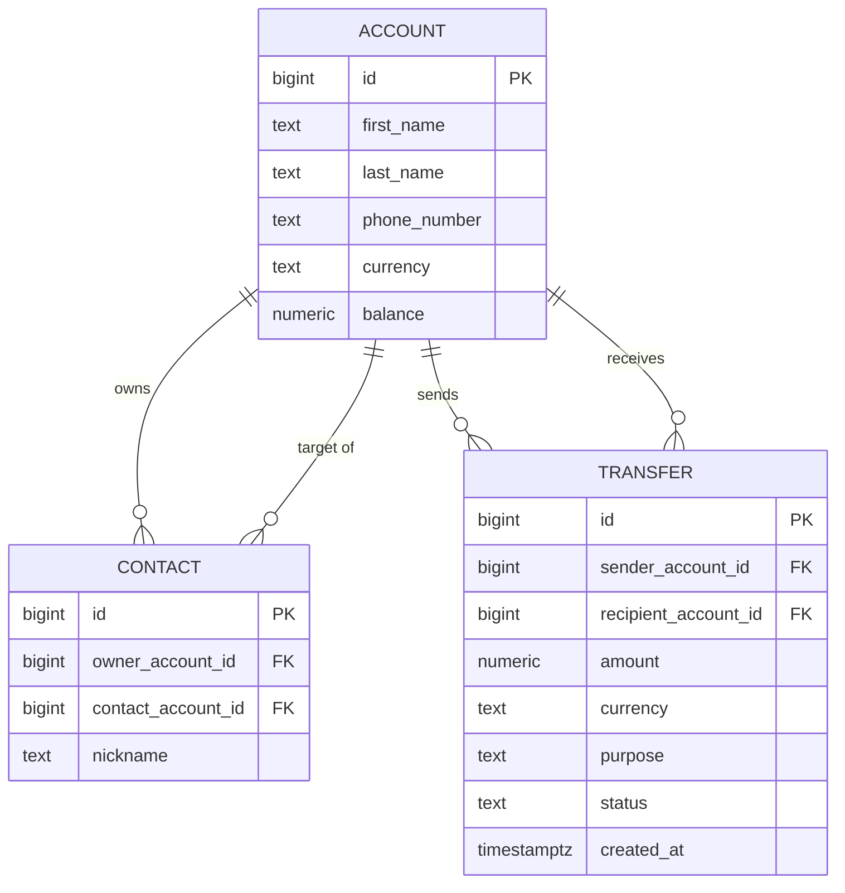

# Data Model (step 1)

The step-1 domain has three persisted aggregates on PostgreSQL, mapped with **Spring Data
JDBC**. Money is `BigDecimal` / `NUMERIC(19,2)`; currency is EUR throughout.

## Aggregates

| Aggregate | Role | Key fields |
|-----------|------|-----------|
| **Account** | A person's profile **and** wallet. The single source of truth for display info and balance. The `id` *is* the person's identity (no separate user table). | `id`, `firstName`, `lastName?`, `phoneNumber?`, `currency`, `balance` |
| **Contact** | A directed edge in an owner's address book — Venmo-"friend" style. References another account; does **not** copy its name/phone. | `id`, `ownerAccountId`, `contactAccountId`, `nickname?` |
| **Transfer** | An immutable ledger row recording money moved between two accounts. | `id`, `senderAccountId`, `recipientAccountId`, `amount`, `currency`, `purpose?`, `status`, `createdAt` |

`TransferStatus` (enum, stored as text): `COMPLETED` · `REVERSED` · `REVERSAL` (the latter two
are used from step 7 / undo).

## Relationships

- **Account 1 —— * Contact (owns):** an account owns many contacts (`contact.owner_account_id`).
- **Account 1 —— * Contact (target):** an account can be the *target* of many contacts
  (`contact.contact_account_id`) — i.e. many people can have you in their address book.
- Because **both ends of a `Contact` are `Account`s**, the `contact` table is effectively a
  **self-referential many-to-many on `account`**, with `nickname` as edge data. A unique
  constraint `(owner_account_id, contact_account_id)` prevents duplicate edges.
- **Account 1 —— * Transfer (sender)** and **Account 1 —— * Transfer (recipient):** an account
  is the sender of many transfers and the recipient of many transfers.
- Display of a contact is **resolved at read time** from the linked account
  (`displayName = nickname ?: "firstName lastName"`, phone from the account) — nothing is
  duplicated onto the contact.

## ER diagram

Column nullability & constraints (from `V1__init.sql`, kept out of the diagram for
compatibility): `account.balance` `CHECK (balance >= 0)`; `transfer.amount` `CHECK (amount > 0)`;
`last_name`, `phone_number`, `nickname`, `purpose` are nullable; `currency` defaults to `EUR`;
`contact` has `UNIQUE (owner_account_id, contact_account_id)`.

## Aggregate ↔ table mapping

| Aggregate (Kotlin) | Table | Notes |
|--------------------|-------|-------|
| `Account` | `account` | `firstName`→`first_name`, etc. |
| `Contact` | `contact` | edge only; name/phone read from the linked `account` |
| `Transfer` | `transfer` | append-only ledger; `status` stored as the enum name |

## Design notes

- **Venmo-style, not saved-payee.** Earlier the `Contact` stored its own `name`/`phone` and a
  `linkedAccountId`; that duplicated identity and could drift from the linked account. The
  contact is now a thin edge and the **account is the single source of truth** (`linkedAccountId`
  → `contactAccountId`).
- **Recipient is an account id.** Transfers move money between accounts; the contact→account
  resolution happens before a transfer, not in the ledger. The agent tools that do this
  resolution conversationally arrive in step 3.
- **Concurrency.** Debits use an atomic conditional `UPDATE ... WHERE balance >= :amount`
  (no read-modify-write), so simultaneous transfers can neither overdraw nor lose updates.

## Evolution across steps

This model grows in later branches: **Koog checkpoint/agent-state** tables (step 5), and undo
posts a compensating `Transfer` with `status = REVERSAL` and marks the original `REVERSED`
(step 7). This document is updated as those land.
